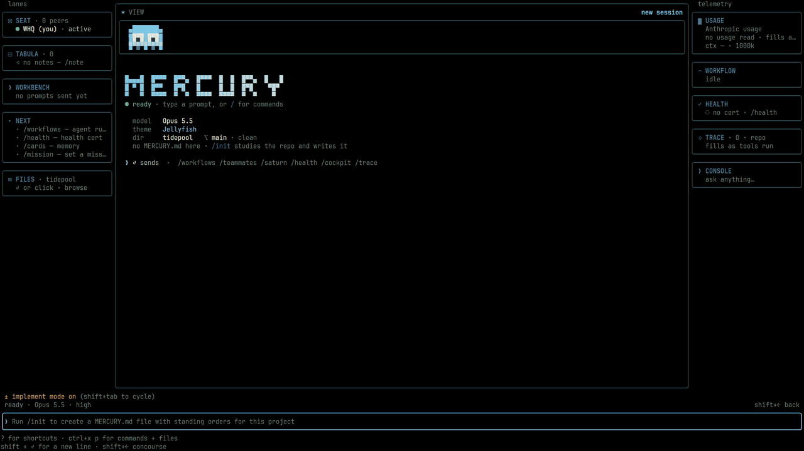

# Mercury

Website: [mercury-cli.ai](https://mercury-cli.ai)

Mercury is a terminal-based coding harness for working with AI models in your
own repositories. It reads and edits files, runs commands, and checks the
results. You choose the provider, the model, and what the agent is allowed to
do.

Each session keeps its own conversation, model, permissions and workspace.
Leave one running while you work in another, then return to it when you need
to. You can switch providers and models within the same chat, use Mercury
from your editor, run it headless in scripts, or schedule work for later.

I use Mercury to develop Mercury, working with several agents and models
across long sessions. Keeping track of that work matters to me: what is still
running, what changed, and what needs a decision.



Mercury is source-available. See [Licence](#licence) for the production-use terms.

## Install

Release archives are available for Apple silicon and Intel Macs, Linux x64,
and Windows x64. Each includes Node and ripgrep, so you need `git` but do not
need to install Node separately.

Choose one installation method:

```sh
curl -fsSL https://mercury-cli.ai/install | sh     # macOS and Linux x64
irm https://mercury-cli.ai/install.ps1 | iex        # Windows x64, in PowerShell 7
brew install Whq02/mercury/mercury                 # Homebrew: macOS and Linux x64
npm install -g mercury-tech-cli                    # npm; `bun install -g mercury-tech-cli` is the same package
mise use -g npm:mercury-tech-cli                   # mise, through the npm package
```

After installation, open a new terminal and run `mercury --version` to check
it. Then run `mercury` from a repository to start the [first run](#the-first-run).
To use Mercury in the terminal you installed from, follow the PATH instruction
printed by the installer.

<details>
<summary>Installation paths, updates and release verification</summary>

### How the installation methods differ

The shell and PowerShell installers fetch the newest release for your
platform, check its SHA-256 against `SHA256SUMS.txt`, unpack it, and run the
archive's own `mercury install` command.

Homebrew and the npm package are each pinned to a particular release and are
republished after a tag, so they can lag behind the newest release. The npm
package, `mercury-tech-cli`, is a launcher that downloads its pinned release;
mise installs that same package.

Mercury's installation is user-local and does not require administrator
access. You can safely rerun an installation command.

### Installation paths

Release versions live under the config home at `~/.mercury/versions/<version>`
(`%USERPROFILE%\.mercury\versions` on Windows). The `mercury` command is
installed in `~/.local/bin` on macOS and Linux, or
`%LOCALAPPDATA%\Mercury\bin` on Windows.

`mercury install` adds the command's directory to PATH once: a guarded line
in your shell startup file, or an entry in the Windows user PATH. A new
terminal picks up the change automatically.

### Updates

Use `mercury update` with any installation method.

For an installation made with the shell or PowerShell installer, or with
`mercury install`, it updates Mercury in place. `--check` checks for updates,
`--status` reports update status, and `--rollback` returns to the previous
version, which stays on disk.

For Homebrew, it asks before running `brew upgrade Whq02/mercury/mercury`.
The default answer is no; enter `y` to approve. Mercury streams the command's
output and checks the installed version afterwards. Use `--yes` to skip the
prompt in scripts.

The npm launcher uses the same release layout as the installers and delegates
each run to the installed release. `mercury update` therefore updates an npm
installation in place through Mercury's own update channel.
`npm update -g mercury-tech-cli` changes only the release the package installs
on its first run. This also applies when using mise.

`--check` reads the same release list for every installation method and tells
you how to update yours. When an update is available, the home screen shows
`vX.Y.Z available · mercury update` once in its bottom-right corner, and the
chat shows a temporary notice. Set `MERCURY_UPDATE_NOTICE=0` to hide both.

Install and update requests use the public release list and archives without
an account or token. A signed-in GitHub CLI (`gh`) is consulted only if the
anonymous request is refused; it is not a requirement.

After an update, Mercury checks whether the command on your PATH points to
the updated installation. If another installation takes precedence, or the
updated command is missing from PATH, it explains the problem and the fix.
`mercury doctor` reports the same issue.

### Release verification

Before activating a release, Mercury checks its archive against
`SHA256SUMS.txt`. It also requires a payload signed by the Mercury release
key in its compiled-in trust roster before staging the update. A rejected
signature leaves the active installation unchanged.

`--allow-unsigned` permits an unsigned payload only. It does not accept an
unknown signing key, a malformed signing block, or tampered contents. Both
the command's result and its local receipt record that exception.

From 1.0.0-beta.3, archives are signed during packaging and their signatures
are verified before publication. A verified installation adds no signature
notice at startup. `mercury doctor` shows `signed — key 627b54b734ca0e72`.

The 1.0.0-beta.2 archives are unsigned. These installations show
`provenance — unsigned` once per install when you start Mercury interactively
without a command or flag. The doctor continues to show that status. It means
the archive manifest has no signature; the download is still checked against
`SHA256SUMS.txt`.

[docs/TRUST.md](docs/TRUST.md) explains the verification results and how to
check an archive manually.
[docs/TERMINAL-RUNTIME.md](docs/TERMINAL-RUNTIME.md) covers startup verification.

### Platform notes

There is no native Linux arm64 or Windows arm64 archive. On Linux arm64, the
installer directs you to [build from source](#build-from-source). On Windows
arm64, the x64 build runs under emulation.

Intel Mac archives are available from 1.0.0-beta.3. They are cross-packaged on
an Apple silicon runner and tested at startup under Rosetta before
publication. Intel Macs using 1.0.0-beta.2 need a source build.

</details>

## Requirements

Release archives include Node 24 LTS. The launcher, `mercury install` and
`mercury update` use that bundled runtime; `git` is the only separate
requirement for the release itself.

To build from source, you need:

- **Node 24 LTS**, in the supported range `>=24.20.0 <25`. `.node-version`
  pins the patch used for builds and included in release archives.
- **bun 1.3.x** for the build. It is not bundled with releases.
- **git**. On Windows, use Windows Terminal or PowerShell 7. See
  [docs/INSTALL-WINDOWS-FROM-SOURCE.md](docs/INSTALL-WINDOWS-FROM-SOURCE.md).

The Node minimum includes the fix for nodejs/node#56645. Below 24.20.0,
headless `-p` runs that call a tool abort on exit on Windows.

Launchers select Node in this order: the explicit `MERCURY_NODE` binary, the
bundled runtime, then a compatible Node installation on PATH. A missing
runtime is reported rather than silently skipped.

### Windows shells

Git for Windows supplies `bash.exe`, which the Bash tool uses when available.
Release archives also include Mercury's bash-compatible shell engine. It is
used automatically on Windows when `bash.exe` is missing.

The doctor's `shell` row tells you which shell is active and why: Git Bash
found on the machine, or the bundled engine because no `bash.exe` was found.
The bundled engine currently cannot run a `.cmd` shim such as `npm` directly;
use `cmd /c npm …` instead. It also needs an absolute program path when running
a program after `cd`.

Set `MERCURY_SHELL_ENGINE=brush`, or choose `brush` in `/config` under Shell
engine, to use the bundled engine even when `bash.exe` is available.
`MERCURY_SHELL_ENGINE=system` uses only the system `bash.exe`.

A source build without the engine pack or Git for Windows still starts, but
the Bash tool is unavailable. The PowerShell tool remains available, and the
`shell` diagnostic explains how to restore Bash support.

## Build from source

Mercury builds with bun and runs on Node 24 LTS:

```sh
bun run setup                      # once; bun install + the vendored packs
bun run build.ts                   # writes dist/mercury.mjs + dist/manifest.json
node dist/mercury.mjs --version
node dist/mercury.mjs
node dist/mercury.mjs doctor --json
```

### Terminal support

The full-screen interface needs a real TTY, but has no minimum terminal size.
The full layout starts at 100 columns by 26 rows; smaller windows use a
compact layout.

Mercury uses 24-bit colour when the terminal advertises support through
`COLORTERM=truecolor` or is recognised as iTerm2, Ghostty, WezTerm, Kitty,
Windows Terminal or VS Code. Other terminals use 256 colours, including
Apple's Terminal on macOS 15 and earlier.

The doctor's Terminal color row reports the detected depth and the reason.
Set `MERCURY_TRUECOLOR=1` for a terminal that supports true colour but does not
advertise it, or `MERCURY_TRUECOLOR=0` to force 256 colours.

### Optional components

`setup` fetches the bundled capability packs: pyright, debugpy, js-debug,
extra grammars, the platform's Node runtime, and brush. If a download fails,
that pack is skipped and the build and affected features report the missing
component. Running `bun install` alone produces a build without those packs.

With a Rust toolchain installed, `setup` also builds the voice capture addon
from `native/voice`. With Rust and cmake, it builds the on-device transcriber
from `native/whisper`. These addons are built locally rather than downloaded;
without the required tools, setup skips them and the doctor reports their
absence. The Windows shell engine is also built locally because upstream
provides no Windows binary.

brush is a bash-compatible shell written in Rust. It is optional on macOS
and Linux, where the system shell remains the default. Select it through
`/config` (`shellEngine`) or `MERCURY_SHELL_ENGINE=brush` to use it for Bash
tool calls with persistent shell state. On Windows, it is selected
automatically when `bash.exe` is missing. See
[docs/TERMINAL-RUNTIME.md](docs/TERMINAL-RUNTIME.md).

The build writes only to `dist/`. Configuration and sessions live in
`~/.mercury`, or the directory set by `MERCURY_CONFIG_DIR`, and are created on
first run. On Windows, run `node dist\mercury.mjs` directly.

### Installing a source build as a command

`scripts/ops/deploy-runtime.sh` publishes a clean-tree build to
`<config home>/runtime/dist`. `scripts/ops/deploy-launcher.sh` installs the
launcher at `<config home>/bin/mercury`. Add that directory to PATH; for zsh:

```sh
echo 'export PATH="$HOME/.mercury/bin:$PATH"' >> ~/.zshrc
```

The launcher reports a missing runtime as an error; it does not silently
switch to another build. Node selection follows the order in
[Requirements](#requirements).

Release installations use `mercury install` and `mercury update` instead.
They do not modify a source checkout or require a GitHub sign-in; `gh` is
consulted only if the anonymous release request is refused.

[AGENTS.md](AGENTS.md) is the short build-and-run guide.
[BUILD-NOTES.md](BUILD-NOTES.md) covers the build in more detail.

## The first run

On your first interactive run, choose an appearance, then sign in to a
provider. The screen previews theme changes as you browse. True Black is
the default; the other option is the oasis dark theme. You can change this
later with `/appearance`.

You can also choose "sign in later" to look around without connecting an
account.

Next, Mercury asks whether you trust the folder you opened. Nothing requested
by a workspace configuration runs before you grant that trust. The grant
covers the whole repository; declining exits Mercury. See
[docs/TRUST.md](docs/TRUST.md).

A normal interactive launch opens the home screen, called the Boot face.
It has ten menu entries, with Continue Last Session appearing only after you
have session history:

- **New Session in \<folder\>** starts a new session in the current folder.
- **Continue Last Session** returns to your most recent chat.
- **Boot Menu** configures future sessions, including motion, sub-agents and
  workflows.
- **MCPs & Skills** chooses what the next session loads. See
  [docs/KIT.md](docs/KIT.md).
- **Agents** creates and edits agents.
- **Doctor / Health Check** checks the installation.
- **Saturn Scheduler** schedules sessions. See
  [docs/SATURN.md](docs/SATURN.md).
- **Logins** connects provider accounts.
- **Session Concourse** opens the current project's session board.
- **Sessions · Projects** lets you choose a session or repository.

Menu entries open over the home screen, and `Esc` returns to the entry you
selected. Session Concourse is the exception: it opens a separate screen,
also available with `Shift+→`. A prompt argument, `--continue` or `--resume`
takes you directly to the chat.

### Motion, sub-agents and workflows

The Boot Menu's Performance section includes a Motion setting:
`auto`, `full`, `reduced` or `off`. It controls idle animation in the
interface and is also available in `/config`.

Under Agents, the Sub-agents and Workflows switches determine whether new
sessions receive the Agent and Workflow tools. Turning a switch off removes
the corresponding tool; attempts to spawn that type of work return the same
explanation. Within a session, `/subagents on|off` and `/workflows on|off`
change the setting at the next turn boundary.

## The daily loop

### Starting a session

Press `Enter` on New Session to create a session in the current folder with
the model shown on screen. The session, chat and board entry are created
together. Mercury keeps a runner ready behind the menu to reduce startup
work.

Starting another session does not stop the previous one. You can leave a
task running and work elsewhere.

### Working in chat

Describe the work in plain language. The agent reads, edits, runs and checks
code under your chosen permission mode. Tool calls appear as they run, either
as compact cards or with full output. Choose the display in `/config` under
Tool output; the setting is saved for later launches.

Use `/model` and `/effort` to adjust the session. `/permissions` controls what
can run without approval and what must ask first; `/policy` controls the
governance policy.

Review changes with `/diff`, by source, file and hunk. `/tasks` shows running
shells and agents. `/clear` parks the chat, `/title` names it, and `/help`
lists the available commands.

### Moving between screens

`Shift+←` and `Shift+→` move between the screens currently available. A fresh
launch has the home screen and Session Concourse. The chat screen is added
when a session is focused and removed when the last chat closes. The key
hints show only the available moves.

Closing every chat returns you to the home screen. Use `--chat` for just the
home screen and chat, without the concourse. `--concourse-off` saves that
preference for future launches; `--concourse-on` or `/config` turns it back on.

### Managing sessions

Open Session Concourse with `/concourse` or `Shift+→` from the home screen.
It shows the current project's running sessions, followed by parked chats,
newest first.

Each live session has a NOW cell showing its current activity. Select a row
and press `Enter` to return to it while the other sessions keep running. A
crashed session stays on the board as NEEDS YOU, with the reason, until you
release it. The terminal bell sounds once when a session needs attention or
finishes a run.

[docs/SESSIONS.md](docs/SESSIONS.md) covers the session lifecycle.

## Providers and models

Use `/logins` to connect a provider. It opens the same sign-in catalogue used
during setup. `/accounts` manages connected provider slots afterwards.

- **OpenAI:** ChatGPT subscription or API key.
- **Claude:** subscription account.
- **Anthropic usage-based billing:** Console sign-in or API key.
- **OpenRouter:** catalogue access through OAuth or an API key.
- **Google Gemini:** API key or Google OAuth.
- **Hugging Face:** device-code sign-in or Hub token.
- **Kimi (Moonshot):** device-code sign-in or API key.
- **GLM (Z.AI):** API key.
- **DeepSeek:** API key.

Local model servers and custom OpenAI-compatible endpoints are discovered or
configured separately, without a provider sign-in. Each provider has its own
protocol, credentials and error handling. A request does not fall back from
one provider to another. See [docs/ENGINES.md](docs/ENGINES.md).

New sessions use your most recently connected provider and the newest model
available to that account. Models the account cannot access are not selected.
If that provider has no usable model, Mercury checks the next most recently
connected provider. This is the selection process for a new session, not
request failover.

`/model` explains the selection. With no provider connected, the home screen
and `/model` direct you to `/logins`. `/defaultprovider` lets you explicitly
make a provider the most recent choice.

Provider access remains subject to the provider's own terms and availability.
Mercury's licence does not replace them.

## The headless CLI

The same build runs without the interactive interface.
`node dist/mercury.mjs --help` lists every flag.

`-p "<prompt>"` runs one non-interactive turn. Choose its output with
`--output-format text|json|stream-json`. `json` returns the result envelope;
`stream-json` includes every event from initialisation to the final result,
without needing another flag.

Use `-c` to continue the most recent conversation, `-r` to resume by ID, title
or picker, `-w` to run in a managed worktree, and `--bare` for minimal mode.

Available commands include:

- **`mercury health`** (alias `doctor`): diagnostic report, also called the
  health certificate. `--json` returns the full report, `--deep` runs the deep
  inventory, and `--fix` runs guided fixes.
- **`mercury auth login|status|logout|token`**: sign in, check authentication,
  sign out, or create a long-lived token.
- **`mercury mcp`**: manage MCP servers with `add`, `add-json`, `list`, `get`,
  `remove` and `serve`.
- **`mercury extensions`**: install extensions and manage their sources.
  Actions: `list`, `sources`, `add`, `remove`, `check`, `install`, `approve`,
  `enable`, `disable`, `update`, `uninstall`, `block`, `unblock`, `validate`
  and `init`.
- **`mercury agents`**: list the agent inventory.
- **`mercury daemon`**: run the background daemon that hosts sessions.
- **`mercury acp --stdio`**: connect an editor through the Agent Client
  Protocol. `mercury editor <action>` manages the IDE integration.
- **`mercury godot run|check|capture|frames|profile|tour|jobs|cancel|result`**:
  manage engine jobs for the Godot project in the current directory. Mercury
  runs suites on its own headless workers from a frozen project copy. The
  service includes a compilation gate, captures, frame statistics, settled
  profiles, job queue access, cancellation and results by ID. See
  [docs/VULCAN-GODOT-TOOLS.md](docs/VULCAN-GODOT-TOOLS.md).
- **`mercury themis`**: run THEMIS integrity tools.
- **`mercury show <image>`**: display an image in the terminal.
- **`mercury install`** and **`mercury update`** (alias `upgrade`): install or
  update release archives. See [Install](#install).

## What is inside

- **Code editing and debugging.** Anchored reads and atomic multi-file edits;
  syntax-based search and rewriting across 23 grammars; persistent code
  cells; and a debugger using the Debug Adapter Protocol. See
  [change transactions](docs/CHANGE-TRANSACTIONS.md),
  [structural patterns](docs/STRUCTURAL-PATTERNS.md),
  [Workshop](docs/WORKSHOP.md) and [the debugger](docs/DEBUGGER.md).
- **Extensions.** Each extension has one manifest. Add sources from a git
  URL, local folder or archive, with approval tied to the contributions hash.
  See [docs/EXTENSIONS.md](docs/EXTENSIONS.md).
- **MCPs & Skills.** Per-repository configuration for what sessions load,
  with named presets and controls you can change during a session. See
  [docs/KIT.md](docs/KIT.md).
- **Agents and teams.** Named agents, an agent studio, workflow runs and
  boards for monitoring their work. See [docs/TEAMS.md](docs/TEAMS.md).
- **Saturn.** Schedule a prompt for an existing session or start a new
  session at a set time. Schedules can run once or recur. See
  [docs/SATURN.md](docs/SATURN.md).
- **Diagnostics.** The doctor and `/health` produce a report backed by
  diagnostic evidence, with a `certified`, `caution` or `fault` verdict and
  verified fixes. See [docs/HEALTH-CERTIFICATE.md](docs/HEALTH-CERTIFICATE.md).
- **Trust, permissions and THEMIS.** Workspace trust, permission rules and
  modes, and the deterministic trust control plane. See
  [docs/TRUST.md](docs/TRUST.md) and
  [docs/THEMIS-CONTROL-PLANE.md](docs/THEMIS-CONTROL-PLANE.md).
- **Apollo Mode.** An initial interview fills in the missing specification,
  then uses it to build a prototype. See
  [docs/APOLLO-MODE.md](docs/APOLLO-MODE.md).
- **Editor integrations.** `mercury acp` connects to editors that support the
  Agent Client Protocol. The VS Code extension (`mercury editor install`)
  runs Mercury in the editor and connects a terminal session to it. `/ide`
  provides access to selections, diagnostics and native diffs. Separate,
  opt-in integrations connect to running Unity, Blender and Godot editors,
  with batch access to Aseprite. See [Unity](docs/UNITY-BRIDGE.md),
  [Blender](docs/BLENDER-BRIDGE.md) and [Aseprite](docs/ASEPRITE-BRIDGE.md).
- **Memory.** Experience cards and a project notepad. See
  [docs/TABULA-NOTES.md](docs/TABULA-NOTES.md).
- **Voice input.** Run `/speak on`, then press space in an empty composer to
  dictate. Transcription can run on-device or through your chosen cloud
  provider. The on-device option uses a 60 MB English model, downloaded once
  with `/speak download`. Audio leaves the machine only after you stop
  recording, and only when using a cloud provider. See
  [docs/VOICE.md](docs/VOICE.md).
- **Computer use.** Enabled by default when the desktop driver is available.
  The model can see your screen and control the mouse and keyboard in the
  foreground application. The first action in each application asks for
  permission by name. `Esc` stops it, only one session can control the
  desktop at a time, and screenshots are not stored in the saved
  conversation. Set `MERCURY_COMPUTER_USE=0` to remove the tool. See
  [docs/COMPUTER-USE.md](docs/COMPUTER-USE.md).
- **Recovery.** Atomic publication, journaled operations and startup
  reconciliation. See [docs/DURABILITY.md](docs/DURABILITY.md).
- **Web search for every model.** Provider-native live search and Mercury's
  bundled WebSearch, using a Brave or Tavily key or a keyless fallback.
  Results identify which search service answered. See
  [docs/ENGINES.md](docs/ENGINES.md).

Runtime flags are defined in `src/substrate/flagRegistry.ts`, exposed as
`MERCURY_*` settings and rendered on demand. Integration compatibility is
documented in [docs/COMPATIBILITY.md](docs/COMPATIBILITY.md). The full
documentation index is [docs/README.md](docs/README.md).

## Every slash command

`/help` lists the interactive commands, `/palette` provides fuzzy search over
the current catalogue, and `/surfaces` indexes the available interfaces. The
table below follows the grouping used by `/help`.

| Domain | Commands |
| --- | --- |
| current work | `/run` `/tasks` `/workbench` `/diff` `/mission` `/themis` `/supervisor` |
| crew & delegation | `/agents` `/subagents` `/teammates` `/crew` `/team` `/workflows` `/fleet` `/monitor` `/router` `/daemon` `/saturn` `/seats` `/live` `/halt` `/kill` `/unkill` `/surfaces` |
| session & context | `/clear` `/compact` `/context` `/auto-compact-window` `/resume` `/rewind` `/sessions` `/concourse` `/branches` `/rename` `/title` `/contract` `/export` `/copy` `/cost` `/usage` `/insights` `/debrief` `/add-dir` `/realms` |
| memory & goals | `/memory` `/cards` `/remember` `/note` `/console` `/orient` |
| model & effort | `/model` `/effort` `/strategy` `/supercode` `/submodels` `/counsel` `/harness` `/caching` |
| git & review | `/branch` `/review` `/security-review` `/pr-comments` |
| health & introspection | `/health` `/verify` `/status` `/trace` `/substrate` `/capabilities` `/capabilities-detail` `/ledger` `/provenance` |
| config & setup | `/config` `/permissions` `/hooks` `/mcp` `/extensions` `/skills` `/policy` `/authority` `/sovereign` `/sandbox` `/ide` `/browser` `/init` `/keybindings` `/keys` `/vim` `/mouse` `/pings` `/terminal-setup` `/bootmenu` `/speak` `/voice` |
| appearance & cockpit | `/cockpit` `/home` `/appearance` `/accent` `/color` `/critter` `/companion` `/palette` `/fullscreen` |
| account & app | `/logins` `/logout` `/accounts` `/defaultprovider` `/update-notes` `/feedback` `/help` `/exit` |

`/mouse off` returns the pointer to the terminal for native text selection
and copying. The preference is saved and appears in `/config` as Mouse
capture.

## Reporting a problem

Run `/bug <what happened>` inside Mercury to preview a report before filing
it through your signed-in GitHub CLI (`gh`). Without `gh`, Mercury saves a
local draft under the config home and points you to the repository's issues
page.

You can also open an issue directly using the bug, provider/model, or feature
request template. Include your `--version` output, OS, terminal and exact
steps. Bug and provider reports also need `mercury doctor --json`, or
`node dist/mercury.mjs doctor --json` for a source build. A transcript of the
failing screen helps.

Report security problems through the repository's Security tab rather than
a public issue. See [SECURITY.md](SECURITY.md).
[CONTRIBUTING.md](CONTRIBUTING.md) covers issues, pull requests and checks.

## Licence

Mercury is source-available under the Business Source License 1.1, with the
Mercury Community Production Grant. The licence is in
[LICENSE.md](LICENSE.md), with its companion
[production terms](MERCURY-COMMUNITY-PRODUCTION-TERMS.md) and
[trademark policy](TRADEMARKS.md). The licence text controls; this is a summary.

You may read, copy, modify and fork the source. Individuals and organisations
below both community thresholds can use Mercury in production for free to
build and sell their own products, including commercial products. Both
consolidated annual revenue and total external funding must be below
US$1,000,000.

A qualifying user that reaches either threshold receives a 90-day grace
period. After that, new product work, including substantial new functionality,
requires a commercial licence. Products already in production when the
threshold was reached can still be maintained using Mercury versions obtained
before the grace period ended, subject to the licence's maintenance terms.

Selling, white-labelling or hosting Mercury itself for third parties, or
offering a substitute for it, requires a commercial licence regardless of
your revenue or funding.

Each version changes to the Apache License 2.0 on its own Change Date, three
years after that version's release.

For commercial licensing and trademark permission, visit
[mercury-cli.ai/licensing](https://mercury-cli.ai/licensing). Bundled
third-party licences are listed in
[THIRD_PARTY_NOTICES.md](THIRD_PARTY_NOTICES.md).
