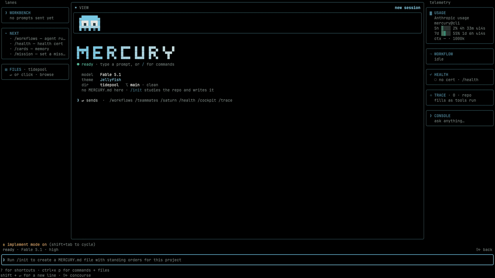

# Mercury

Website: [mercury-cli.ai](https://mercury-cli.ai)

Mercury runs AI coding agents in your terminal, inside your own repositories.
An agent reads and edits files, runs commands, and checks the results. You
choose the provider, the model, and what the agent is allowed to do.

Each session keeps its own conversation, model, permissions and workspace.
Leave one running while you work in another, then return to it when you need
to. You can switch providers and models within the same chat, use Mercury
from your editor, run it headless in scripts, or schedule work for later.

I use Mercury to develop Mercury, working with several agents and models
across long sessions. Keeping track of that work matters to me: what is still
running, what changed, and what needs a decision.



Mercury is source-available. See [Licence](#licence) for the production-use terms.

## Install

Release archives are available for Apple silicon and Intel Macs, Linux x64,
and Windows x64. Install `git` separately; each archive includes Node and
ripgrep, so a separate Node installation is unnecessary.

Choose one installation method:

```sh
curl -fsSL https://mercury-cli.ai/install | sh     # macOS and Linux x64
irm https://mercury-cli.ai/install.ps1 | iex        # Windows x64, in PowerShell 7
brew install Whq02/mercury/mercury                 # Homebrew: macOS and Linux x64
npm install -g mercury-tech-cli                    # npm; `bun install -g mercury-tech-cli` is the same package
mise use -g npm:mercury-tech-cli                   # mise, through the npm package
```

After installation, open a new terminal and run `mercury --version` to check
it. Then run `mercury` from a repository to start the [first run](#the-first-run).
To use Mercury in the terminal you installed from, follow the PATH instruction
printed by the installer.

<details>
<summary>Installation paths, updates and release verification</summary>

### How the installation methods differ

The shell and PowerShell installers fetch the newest release for your
platform, check its SHA-256 against `SHA256SUMS.txt`, unpack it, and run the
archive's own `mercury install` command.

Homebrew and the npm package are each pinned to a particular release and are
republished after a tag, so they can lag behind the newest release. The npm
package, `mercury-tech-cli`, is a launcher that downloads its pinned release;
mise installs that same package.

Mercury's installation is user-local and does not require administrator
access. You can safely rerun an installation command.

### Installation paths

Release versions live under the config home at `~/.mercury/versions/<version>`
(`%USERPROFILE%\.mercury\versions` on Windows). The `mercury` command is
installed in `~/.local/bin` on macOS and Linux, or
`%LOCALAPPDATA%\Mercury\bin` on Windows.

`mercury install` adds the command's directory to PATH once: a guarded line
in your shell startup file, or an entry in the Windows user PATH. A new
terminal picks up the change automatically.

### Updates

Use `mercury update` with any installation method.

For an installation made with the shell or PowerShell installer, or with
`mercury install`, it updates Mercury in place. `--check` checks for updates,
`--status` reports update status, and `--rollback` returns to the previous
version, which stays on disk.

For Homebrew, it asks before running `brew upgrade Whq02/mercury/mercury`.
The default answer is no; enter `y` to approve. Mercury streams the command's
output and checks the installed version afterwards. Use `--yes` to skip the
prompt in scripts.

The npm launcher uses the same release layout as the installers and delegates
each run to the installed release. `mercury update` therefore updates an npm
installation in place through Mercury's own update channel.
`npm update -g mercury-tech-cli` changes only the release the package installs
on its first run. This also applies when using mise.

`--check` reads the same release list for every installation method and tells
you how to update yours. When an update is available, the home screen shows
`vX.Y.Z available · mercury update` once in its bottom-right corner, and the
chat shows a temporary notice. Set `MERCURY_UPDATE_NOTICE=0` to hide both.

Install and update requests fetch the public release list and archives
anonymously. You can run them without an account or token. If an anonymous
request is refused, Mercury consults a signed-in GitHub CLI (`gh`).

After an update, Mercury checks whether the command on your PATH points to
the updated installation. If another installation takes precedence, or the
updated command is missing from PATH, it explains the problem and the fix.
`mercury health` reports the same issue.

### Release verification

Before activating a release, Mercury checks its archive against
`SHA256SUMS.txt`. It also requires a payload signed by the Mercury release
key in its compiled-in trust roster before staging the update. A rejected
signature leaves the active installation unchanged.

Use `--allow-unsigned` to accept an unsigned payload. Mercury still rejects
unknown signing keys, malformed signing blocks and tampered contents. The
command result and its local record both show that you allowed an unsigned
payload.

From 1.0.0-beta.3, archives are signed during packaging and their signatures
are verified before publication. A verified installation adds no signature
notice at startup. `mercury health` shows `signed — key 627b54b734ca0e72`.

The 1.0.0-beta.2 archives are unsigned. These installations show
`provenance — unsigned` once per install when you start Mercury interactively
without a command or flag. The health check continues to show that status. It means
the archive manifest has no signature; the download is still checked against
`SHA256SUMS.txt`.

[docs/TRUST.md](docs/TRUST.md) explains the verification results and how to
check an archive manually.
[docs/TERMINAL-RUNTIME.md](docs/TERMINAL-RUNTIME.md) covers startup verification.

### Platform notes

On Linux arm64, follow the installer’s instruction to
[build from source](#build-from-source). On Windows arm64, use the x64 archive
under emulation. Mercury has no native archive for either arm64 platform.

Intel Mac archives are available from 1.0.0-beta.3. They are cross-packaged on
an Apple silicon runner and tested at startup under Rosetta before
publication. Intel Macs using 1.0.0-beta.2 need a source build.

</details>

## Requirements

Release archives include Node 24 LTS. The launcher, `mercury install` and
`mercury update` use that bundled runtime; `git` is the only separate
requirement for the release itself.

To build from source, you need:

- **Node 24 LTS**, in the supported range `>=24.20.0 <25`. `.node-version`
  pins the patch used for builds and included in release archives.
- **bun 1.3.x** for the build. It is not bundled with releases.
- **git**. On Windows, run PowerShell 7 inside Windows Terminal or the
  VS Code terminal. See
  [docs/INSTALL-WINDOWS-FROM-SOURCE.md](docs/INSTALL-WINDOWS-FROM-SOURCE.md).

The Node minimum includes the fix for nodejs/node#56645. Below 24.20.0,
headless `run` commands that call a tool abort on exit on Windows.

Launchers select Node in this order: the explicit `MERCURY_NODE` binary, the
bundled runtime, then a compatible Node installation on PATH. If the runtime
is missing, the launcher reports an error.

### Windows shells

Git for Windows supplies `bash.exe`, which the Bash tool uses when available.
Release archives also include Mercury's bash-compatible shell engine. It is
used automatically on Windows when `bash.exe` is missing.

Read the health check's `shell` row to see which shell is active and why. It shows
Git Bash when `bash.exe` is available, or the bundled engine when it is
missing. The bundled engine requires `cmd /c npm …` to run a `.cmd` shim
such as `npm`; running the shim directly fails. After `cd`, give the engine
an absolute path to the program you want to run.

Set `MERCURY_SHELL_ENGINE=brush`, or choose `brush` in `/config` under Shell
engine, to use the bundled engine even when `bash.exe` is available.
`MERCURY_SHELL_ENGINE=system` uses only the system `bash.exe`.

A source build without the engine pack or Git for Windows still starts, but
the Bash tool is unavailable. The PowerShell tool remains available, and the
`shell` diagnostic explains how to restore Bash support.

## Build from source

Mercury builds with bun and runs on Node 24 LTS:

```sh
bun run setup                      # once; bun install + the vendored packs
bun run build.ts                   # writes dist/mercury.mjs + dist/manifest.json
node dist/mercury.mjs --version
node dist/mercury.mjs
node dist/mercury.mjs health --json
```

### Terminal support

The full-screen interface needs a real TTY, but has no minimum terminal size.
The full layout starts at 100 columns by 26 rows; smaller windows use a
compact layout.

Mercury uses 24-bit colour when the terminal advertises support through
`COLORTERM=truecolor` or is recognised as iTerm2, Ghostty, WezTerm, Kitty,
Windows Terminal or VS Code. Other terminals use 256 colours, including
Apple's Terminal on macOS 15 and earlier.

The health check's Terminal color row reports the detected depth and the reason.
Set `MERCURY_TRUECOLOR=1` for a terminal that supports true colour but does not
advertise it, or `MERCURY_TRUECOLOR=0` to force 256 colours.

### Optional components

`setup` fetches the bundled capability packs: pyright, debugpy, js-debug,
extra grammars, the platform's Node runtime, and brush. If a download fails,
that pack is skipped and the build and affected features report the missing
component. Running `bun install` alone produces a build without those packs.

To build voice support, run `setup` with Rust installed. That builds
`native/voice`. Add cmake to build `native/whisper` as well. If either
build lacks its tools, setup skips it and the health check reports the missing
addon. Both addons are compiled on your machine. The Windows shell engine
is compiled there too because upstream has no Windows binary.

brush is a bash-compatible shell written in Rust. It is optional on macOS
and Linux, where the system shell remains the default. Select it through
`/config` (`shell.engine`) or `MERCURY_SHELL_ENGINE=brush` to use it for Bash
tool calls with persistent shell state. On Windows, it is selected
automatically when `bash.exe` is missing. See
[docs/TERMINAL-RUNTIME.md](docs/TERMINAL-RUNTIME.md).

The build writes only to `dist/`. Configuration and sessions live in
`~/.mercury`, or the directory set by `MERCURY_CONFIG_DIR`, and are created on
first run. On Windows, run `node dist\mercury.mjs` directly.

### Installing a source build as a command

`scripts/ops/deploy-runtime.sh` publishes a clean-tree build to a fresh
`<config home>/runtime/builds/<build>` folder and points `runtime/current` at it
(`runtime/dist` is the older name for the same link). `scripts/ops/deploy-launcher.sh`
installs the launcher at `<config home>/bin/mercury`. Add that directory to PATH; for zsh:

```sh
echo 'export PATH="$HOME/.mercury/bin:$PATH"' >> ~/.zshrc
```

The launcher stops with an error if the runtime is missing. It does not
switch to another build. Node selection follows the order in
[Requirements](#requirements).

For a release installation, run `mercury install` or `mercury update`. These
commands leave source checkouts unchanged and need no GitHub sign-in.
Mercury consults `gh` only if the anonymous release request is refused.

[AGENTS.md](AGENTS.md) is the short build-and-run guide.
[BUILD-NOTES.md](BUILD-NOTES.md) covers the build in more detail.

## The first run

On your first interactive run, choose an appearance, then sign in to a
provider. The screen previews theme changes as you browse. True Black is
the default; the other option is the oasis dark theme. You can change this
later with `/appearance`.

You can also choose "sign in later" to look around without connecting an
account. When a provider key in your environment already signs a provider
in, the sign-in step is not asked. In a terminal Mercury knows how to
configure (Terminal.app, the VS Code family, Alacritty, Zed), a Terminal keys
step offers to write one key binding into the terminal's own settings; it is
off unless you choose it, and a backup is kept.

Next, Mercury asks whether you trust the folder you opened. Nothing requested
by a workspace configuration runs before you grant that trust. The grant
covers the whole repository; declining exits Mercury. See
[docs/TRUST.md](docs/TRUST.md).

A normal interactive launch opens the home screen, called the Boot face.
It has ten menu entries, with Continue Last Session appearing only after you
have session history:

- **New Session in \<folder\>** starts a new session in the current folder.
- **Continue Last Session** returns to your most recent chat.
- **Boot Menu** configures future sessions, including motion, sub-agents and
  workflows.
- **MCPs & Skills** chooses what the next session loads. See
  [docs/KIT.md](docs/KIT.md).
- **Agents** creates and edits agents.
- **Health Check** checks the installation.
- **Saturn Scheduler** schedules sessions. See
  [docs/SATURN.md](docs/SATURN.md).
- **Logins** connects provider accounts.
- **Session Concourse** opens the current project’s session list.
- **Sessions · Projects** lets you choose a session or repository.

Menu entries open over the home screen, and `Esc` returns to the entry you
selected. The session list opens on a separate screen, also available with
`Shift+→`. A prompt argument, `--continue` or `--resume` takes you directly
to the chat.

### Motion, sub-agents and workflows

The Boot Menu's Performance section includes a Motion setting:
`auto`, `full`, `reduced` or `off`. It controls idle animation in the
interface and is also available in `/config`.

Under Agents, the Sub-agents and Workflows switches determine whether new
sessions receive the Agent and Workflow tools. Turning a switch off removes
the corresponding tool; attempts to spawn that type of work return the same
explanation. Within a session, `/subagents on|off` and `/workflows on|off`
change the setting at the next turn boundary.

## The daily loop

### Starting a session

Press `Enter` on New Session to create a session in the current folder with
the model shown on screen. Mercury opens its chat and adds it to the session
list at the same time. It keeps a process ready behind the menu to reduce
startup work.

Starting another session does not stop the previous one. You can leave a
task running and work elsewhere.

### Working in chat

Describe the work in plain language. The agent reads, edits, runs and checks
code under your chosen permission mode. Tool calls appear as they run, either
as compact cards or with full output. Choose the display in `/config` under
Tool output; the setting is saved for later launches.

Use `/model` and `/effort` to adjust the session. `/permissions` controls what
can run without approval and what must ask first. `/policy` is a read-only
view of the current permission mode, sandbox settings and other permission
controls.

Review changes with `/diff`, by source, file and hunk. `/runs` shows running
shells and agents (`/tasks` still opens the same board). When no turn is
running, `/clear` saves the current chat for later and opens a fresh session;
`/title` names the chat, and `/help` lists the available commands.

### Moving between screens

`Shift+←` and `Shift+→` move between the screens currently available. A fresh
launch has the home screen and session list. The chat screen is added when
a session is focused and removed when the last chat closes. The key hints
show only the available moves.

Closing every chat returns you to the home screen. Use `--chat` for just the
home screen and chat, without the session list. `--concourse-off` saves that
preference for future launches; `--concourse-on` or `/config` turns it back on.

### Managing sessions

Open the session list with `/concourse` or `Shift+→` from the home screen.
It shows the current project’s running sessions first, followed by saved
chats that are not running, newest first.

Each running session has a NOW cell showing its current activity. Select a
row and press `Enter` to return to the chat while the other sessions keep
running. A crashed session stays on the session list as NEEDS YOU, with the
reason, until you release it.

[docs/SESSIONS.md](docs/SESSIONS.md) covers the session lifecycle.

## Providers and models

Use `/logins` to connect a provider. It opens the same sign-in catalogue used
during setup. `/accounts` manages connected provider slots afterwards.

- **OpenAI:** ChatGPT subscription or API key.
- **Claude:** subscription account.
- **Anthropic usage-based billing:** Console sign-in or API key.
- **OpenRouter:** catalogue access through OAuth or an API key; model requests deny data collection and require every parameter from the start. `/config → OpenRouter routing policy` offers fallback and zero-data-retention choices; choose open to relax the policy and leave routing to OpenRouter.
- **Google Gemini:** API key or your own OAuth client; Cloud project billing, not AI Pro/Ultra. Consumer Google sign-in ended June 18, 2026 (Gemini CLI too).
- **Hugging Face:** device-code sign-in or Hub token.
- **Kimi (Moonshot):** device-code sign-in or API key.
- **GLM (Z.AI):** API key.
- **DeepSeek:** API key.
- **xAI (Grok):** sign in with your Grok subscription (SuperGrok / X Premium) or paste an API key through `/logins xai`.
- **Meta (Muse):** pay-as-you-go Model API key; Muse Code subscriptions are for Muse Code only.

Local model servers and custom OpenAI-compatible endpoints are discovered or
configured separately, without a provider sign-in. Each provider has its own
protocol, credentials and error handling. A request does not fall back from
one provider to another. See [docs/ENGINES.md](docs/ENGINES.md).

New sessions use your most recently connected provider and the newest model
available to that account. Models the account cannot access are skipped.
If that provider has no usable model, Mercury checks the next most recently
connected provider. This choice happens when the session starts; a failed
request in an existing session stays with its provider.

`/model` explains the selection. A family word picks that family's newest
model: `/model grok`, `/model deepseek`, `/model kimi` or `/model glm`. With
no provider connected, the home screen and `/model` direct you to `/logins`.
`/defaultprovider` lets you explicitly make a provider the most recent
choice.

Provider access remains subject to the provider's own terms and availability.
Mercury's licence does not replace them.

## The headless CLI

The same build runs without the interactive interface.
`node dist/mercury.mjs --help` lists every flag.

`mercury run "<prompt>"` runs a prompt without a terminal UI:

```sh
mercury run "Summarise this repository." --format text
mercury run "Summarise this repository." --format json
mercury run "Summarise this repository." --format rows
```

- `text` prints the answer; a failed turn's reason goes to stderr.
- `json` prints the last `outcome` row as one JSON object.
- `rows` writes one JSON object per line: `session`, then a `turn` and its
  `text`, `reasoning`, `tool_call`, `tool_result` and `step` rows, ending in
  `outcome`. Waits, tool progress, background tasks and notices have their
  own rows. Every row carries `seq`, `timestamp` and `session_id`; rows
  within a turn also carry its `turn` number.

The output row types, by their `type` field:

- `session` — the opening row: `version`, `cwd`, `model`, `mode`, and the
  `tools`, `mcp_servers`, `commands`, `agents`, `skills` and `extensions` the
  session has.
- `turn` — a turn `started` or `waiting`, with its `turn_id`; `model`,
  `message_ids` and the `agents` count when known.
- `text` — a settled text block: `message_id`, `block`, `text`, and its
  `phase` (`commentary` or `final_answer`).
- `reasoning` — a settled reasoning block: `message_id`, `block`, `text`, or
  `redacted: true`.
- `tool_call` — a tool call: `call_id`, `tool`, `input`, with its
  `message_id` and `block`.
- `tool_result` — the call's result: `call_id`, `status` (`ok`, `error` or
  `aborted`) and `output`.
- `tool_update` — progress from a running shell, PowerShell or MCP call:
  `call_id`, `tick`, `source`, and whichever of `line`, `elapsed_s`, `lines`,
  `bytes`, `budget_ms`, `progress` and `total` the call reports.
- `step` — one model call of the main thread: `message_id`, `model`, `usage`,
  and `stop` when the model said why it stopped.
- `outcome` — the turn's result, described below.
- `wait` — a wait on the model: `state` (`first_byte`, `retry`, `silence`,
  `loading` or `done`) with the figures that state carries, such as
  `since_ms`, `attempt` and `of`, `delay_ms`, `reason` and `http_status`.
- `heartbeat` — the run is alive; the row carries nothing else.
- `compaction` — a compaction `started`, in `progress` or `ended`: `trigger`
  (`manual`, `auto` or `overflow`), `stage`, `fill`, `summary_tokens` and, at
  the end, `exit` (`landed`, `cancelled` or `failed`).
- `mode` — the permission mode changed: `mode`.
- `rate_limit` — the provider's limit state: `status` (`allowed`, `warning` or
  `rejected`), `window`, `resets_at`, `utilization` and the overage fields.
- `task` — a background task `started`, in `progress` or `ended`: `task_id`,
  `task_type`, `description`, `usage`, `summary`, `status` (`completed`,
  `failed` or `stopped`) and `output_file` as they become known.
- `notice` — a `warning` or `error` for the reader: `text`, and a `code` such
  as `input_refused`.
- `command_output` — the output of a slash command that never reached the
  model: `command` and `text`.
- `mission_updated` — the session's task ledger changed; read it again.
- `samples_updated` — the session's samples changed; read them again.

`--partial` with `--format rows` adds `block_start`, `text_delta`,
`reasoning_delta`, `tool_input_delta` and `retracted` rows. Deltas belong to
`message_id` and `block`; a `retracted` row withdraws that message's deltas.
The settled text or tool row is the complete value.

The outcome carries `schema`, `turn_id`, `status`, `steps`, `wall_ms`,
`usage`, `models` and `denials`, with `answer` on completion and `error`
(`message`, `class`, optional `detail`) on failure. `stop`, measured
`api_ms`, known `cost_usd`, requested `structured` output and `notices` are
included when available. Usage names `input_tokens` (cached tokens included),
`cached_input_tokens`, `cache_write_input_tokens`, `output_tokens` and,
when reported, `reasoning_output_tokens`. `models` gives the per-model
figures; `steps` counts the main thread's model calls.

The status is `completed`, `blocked`, `refused`, `failed`, `interrupted`,
`turn_limit`, `budget_limit`, `schema_unmet` or `loop_stopped`. A completed
run exits 0, other outcomes exit 1, and a usage error exits 2. SIGINT and
SIGTERM exit 130 and 143 after the interrupted turn's outcome is flushed. A
refused tool call is listed in `denials`; it does not make a completed turn a
failure. A run whose final answer ends with the two lines `BLOCKED ON
OPERATOR: …` and `RESUME WHEN: …` is `blocked`: the answer is kept, `error`
carries the blocker and the resume condition, and the run exits 1.

`--input rows` requires `--format rows` and reads one input object per line:

```sh
printf '%s\n' '{"type":"prompt","content":"Summarise this repository."}' | mercury run --input rows --format rows
```

The input types are `prompt` with `content` (text or text/image blocks),
`shell` with `command`, and `note` with `to` (an agent id) and `content`.
Each accepts an optional `id`; prompt and shell rows also accept `priority`
(`now`, `next` or `later`), `sent_at` and `origin`. A rejected input shape
produces a `notice` with code `input_refused`; malformed JSON ends the run.
These are input rows, not permission answers.

Use `mercury run -` or pipe text into `mercury run` to read the whole prompt
from stdin. Beside a prompt argument, piped text is collected for up to one
second and appended as delimited context. With no prompt and a terminal on
stdin, `run` prints its usage and exits 2.

`--mode <mode>` selects the permission posture. `--sovereign` runs without
permission prompts, and `--allow-sovereign` makes that posture available for
a later switch. Permission policy and deny rules still apply. A root user
entering sovereign mode gets one notice on stderr; the run continues.

Use `-c` to continue the most recent conversation, `-r` to resume by ID, title
or picker, `-w` to run in a managed worktree, and `--lean` for a minimal session.
A `run` has no host to answer permission asks: its permission rules and mode
decide what can run, and a call that still needs approval is denied.

### Hosting a session

`mercury runner` serves a session to a host over stdio: JSON-RPC 2.0, one
message per line. The host sends `initialize` first and waits for the answer
before sending work:

```json
{"jsonrpc":"2.0","id":1,"method":"initialize","params":{"protocol":1,"host":{"name":"my-host","version":"1.0.0"},"capabilities":{"holds_asks":true,"elicitation":false,"partial_rows":false}}}
```

The host's name and version travel under `host`; `capabilities` declares
`holds_asks`, `elicitation` and `partial_rows`. Every request `id` is a
positive integer: a request whose `id` is anything else is answered `-32600`
with `id: null`, so number requests from 1.

`queue/add` takes the same prompt, shell or note object as the row input
above. Output arrives in `row` notifications. `session/facts` reads the
session's state; `session/set_model`, `session/set_effort` and
`session/set_mode` change its choices. A change held until the turn ends
answers with `at: "turn_end"`, then `session/applied` announces it.
`turn/interrupt` stops a turn; close stdin to end the session.

Permission asks arrive as `permission/request`, with `kind: "tool"` or
`kind: "network"`. The host answers with `outcome: "allow"` or
`outcome: "deny"`; an allow may carry edited `input` and permission `rules`.
A withdrawn ask sends `$/cancel_request` with its `request_id`.
`holds_asks` gives the host ownership of the ask's clock. An MCP question
uses `elicitation/request` only when the host declares `elicitation`;
otherwise it is answered `cancel`.

An unknown method answers `-32601`, invalid parameters `-32602`, an `id` that
is not a positive integer `-32600`, and a request before initialization
`-32002`. A rule refusal is `-32010`, with a
sentence in `error.message` and a reason in `error.data.kind`, such as
`mode`, `model`, `effort` or `claim`. The runner answers a malformed line
with `-32700` and continues; three consecutive malformed lines end it.

### Other commands

Available commands include:

- **`mercury health`**: diagnostic report, also called the
  health certificate. `--json` returns the full report, `--deep` runs the deep
  inventory, and `--fix` runs guided fixes.
- **`mercury auth login|status|logout|mint`**: sign in, check authentication,
  sign out, or create a long-lived token.
- **`mercury mcp`**: manage MCP servers with `add`, `import`, `list`, `get`,
  `remove`, `trust-reset` and `serve`.
- **`mercury extensions`**: install extensions and manage their sources.
  Actions: `list`, `sources`, `add`, `remove`, `refresh`, `install`, `trust`,
  `enable`, `disable`, `update`, `uninstall`, `fence`, `unfence`, `inspect`
  and `scaffold`.
- **`mercury roster`**: list the agent inventory.
- **`mercury daemon run|status|stop|restart`**: run, inspect, stop or restart
  the background daemon. Its session seats and named crewmates are `mercury runner`
  children; the daemon sends their prompts and hosts their permission asks.
- **`mercury acp`**: serve an editor over the Agent Client Protocol, with a
  runner child for each session. `mercury bridge install` installs the
  VS Code extension; `mercury bridge status` checks it.
- **`mercury godot run|check|capture|frames|profile|tour|jobs|cancel|result`**:
  manage engine jobs for the Godot project in the current directory. Mercury
  runs suites on its own headless workers from a frozen project copy. The
  service includes a compilation gate, captures, frame statistics, settled
  profiles, job queue access, cancellation and results by ID. See
  [docs/VULCAN-GODOT-TOOLS.md](docs/VULCAN-GODOT-TOOLS.md).
- **`mercury image <image>`**: display an image in the terminal.
- **`mercury install`** and **`mercury update`** (alias `upgrade`): install or
  update release archives. See [Install](#install).

## What is inside

- **Code editing and debugging.** Anchored reads and atomic multi-file edits;
  syntax-based search and rewriting across 23 grammars; persistent code
  cells; and a debugger using the Debug Adapter Protocol. See
  [change transactions](docs/CHANGE-TRANSACTIONS.md),
  [structural patterns](docs/STRUCTURAL-PATTERNS.md),
  [Workshop](docs/WORKSHOP.md) and [the debugger](docs/DEBUGGER.md).
- **Extensions.** Each extension has one manifest. Add sources from a git
  URL, local folder or archive, with approval tied to the contributions hash.
  See [docs/EXTENSIONS.md](docs/EXTENSIONS.md).
- **MCPs & Skills.** Per-repository configuration for what sessions load,
  with named presets and controls you can change during a session. See
  [docs/KIT.md](docs/KIT.md).
- **Agents and the crew.** Two built-in agents — `mercury-crew` for delegated
  work of every kind and `mercury-scout` for read-only reconnaissance — plus
  the agent definitions you create in the agent studio. The daemon hosts
  named crewmates in their own runners; delegated sub-agents belong to the
  session that launched them. Follow both, and workflow runs, in their
  status views. See
  [docs/CREW.md](docs/CREW.md).
- **Saturn.** Schedule a prompt for an existing session or start a new
  session at a set time. Schedules can run once or recur. See
  [docs/SATURN.md](docs/SATURN.md).
- **Diagnostics.** The health check and `/health` produce a report backed by
  diagnostic evidence, with a `certified`, `caution` or `fault` verdict and
  verified fixes. See [docs/HEALTH-CERTIFICATE.md](docs/HEALTH-CERTIFICATE.md).
- **Trust and permissions.** Workspace trust, permission rules and modes,
  and the commands every session refuses. See
  [docs/TRUST.md](docs/TRUST.md).
- **Apollo Mode**, the specification interview: answer the agent’s questions
  to complete the specification it will use to build a prototype. See
  [docs/APOLLO-MODE.md](docs/APOLLO-MODE.md).
- **Editor integrations.** `mercury acp` connects to editors that support the
  Agent Client Protocol. The VS Code extension (`mercury bridge install`)
  runs Mercury in the editor over that protocol: chat, sessions, agents,
  artifacts and reviews, with the editor's selection and diagnostics riding
  each prompt. Separate, opt-in integrations connect to running Unity,
  Blender and Godot editors, with batch access to Aseprite. See [Unity](docs/UNITY-BRIDGE.md),
  [Blender](docs/BLENDER-BRIDGE.md) and [Aseprite](docs/ASEPRITE-BRIDGE.md).
- **Memory.** Mneme is on by default. It keeps what each project's sessions
  learn in topic pages, loads a front page and your pinned rules into every
  chat, and looks facts
  up on every message; `/memory` is the front door. See
  [docs/MNEME.md](docs/MNEME.md).
- **Voice input.** Run `/speak on`, then hold space for 1 s to dictate and
  release it to stop. Transcription can run on-device or through your chosen cloud
  provider. The on-device option uses a 60 MB English model, downloaded once
  with `/speak download`. Audio leaves the machine only after you stop
  recording, and only when using a cloud provider. See
  [docs/VOICE.md](docs/VOICE.md).
- **Computer use.** Enabled by default when the desktop driver is available.
  The model can see your screen and control the mouse and keyboard in the
  foreground application. Mercury checks the application by name before
  acting. It asks for approval unless an applicable permission rule, session
  grant, access setting or permission mode already allows the action; explicit
  denies stay blocked. `Esc` stops it, only one session can control the desktop at a time,
  and screenshots are not stored in the saved conversation. Set
  `MERCURY_COMPUTER_USE=0` to remove the tool. See
  [docs/COMPUTER-USE.md](docs/COMPUTER-USE.md).
- **Recovery.** Atomic publication, journaled operations and startup
  reconciliation. See [docs/DURABILITY.md](docs/DURABILITY.md).
- **Web search for every model.** Provider-native live search and Mercury's
  bundled WebSearch, using a Brave or Tavily key or a keyless fallback.
  Results identify which search service answered. See
  [docs/ENGINES.md](docs/ENGINES.md).

Runtime flags are defined in `src/substrate/flagRegistry.ts`, exposed as
`MERCURY_*` settings and rendered on demand. Integration compatibility is
documented in [docs/COMPATIBILITY.md](docs/COMPATIBILITY.md). The full
documentation index is [docs/README.md](docs/README.md).

## Slash commands

`/help` lists the available interactive commands. Use `/palette` for fuzzy
command search and `/surfaces` to find the available interfaces. The table
below groups the main built-in commands by the categories used in `/help`;
the live list can also include skills and extension commands.

| Domain | Commands |
| --- | --- |
| current work | `/run` `/runs` `/workbench` `/diff` `/mission` |
| crew & delegation | `/agents` `/subagents` `/crewmates` `/crew` `/workflows` `/fleet` `/monitor` `/router` `/daemon` `/saturn` `/seats` `/live` `/halt` `/kill` `/unkill` `/surfaces` |
| session & context | `/clear` `/compact` `/context` `/auto-compact-window` `/resume` `/rewind` `/sessions` `/concourse` `/branches` `/rename` `/title` `/contract` `/export` `/copy` `/usage` `/debrief` `/realms` |
| memory & goals | `/memory` `/console` `/orient` |
| model & effort | `/model` `/effort` `/submodels` `/advise` `/counsel` `/harness` `/caching` |
| git & review | `/branch` `/review` `/audit` |
| health & introspection | `/health` `/verify` `/status` `/trace` `/substrate` `/capabilities` `/capabilities-detail` `/ledger` `/provenance` |
| config & setup | `/config` `/jev` `/jevor` `/localsetup` `/permissions` `/hooks` `/mcp` `/extensions` `/skills` `/policy` `/authority` `/sovereign` `/sandbox` `/browser` `/init` `/keybindings` `/keys` `/vim` `/mouse` `/keysetup` `/bootmenu` `/speak` `/voice` |
| appearance & cockpit | `/cockpit` `/home` `/appearance` `/accent` `/critter` `/view` `/palette` `/fullscreen` |
| account & app | `/logins` `/logout` `/accounts` `/defaultprovider` `/update-notes` `/feedback` `/help` `/exit` |

`/mouse off` returns the pointer to the terminal for native text selection
and copying. The preference is saved and appears in `/config` as Mouse
capture.

A required argument starts with `<…>` in a skill’s usage. For example,
`/update-config`, `/debug` and `/app-proof` need an argument. Send one
alone and you get its description and usage; no turn starts. Select it
in typeahead and Enter leaves `/name ` ready for you to add the argument.
`/simplify` and `/loop` have no required argument and run immediately.

## Reporting a problem

Run `/bug <what happened>` inside Mercury to preview a report before filing
it through your signed-in GitHub CLI (`gh`). Without `gh`, Mercury saves a
local draft under the config home and points you to the repository's issues
page.

You can also open an issue directly using the bug, provider/model, or feature
request template. Include your `--version` output, OS, terminal and exact
steps. Bug and provider reports also need `mercury health --json`, or
`node dist/mercury.mjs health --json` for a source build. A transcript of the
failing screen helps.

Report security problems privately through the repository’s Security tab.
Keep them out of public issues. See [SECURITY.md](SECURITY.md).
[CONTRIBUTING.md](CONTRIBUTING.md) covers issues, pull requests and checks.

## Licence

Mercury is source-available under the Business Source License 1.1, with the
Mercury Community Production Grant. The licence is in
[LICENSE.md](LICENSE.md), with its companion
[production terms](MERCURY-COMMUNITY-PRODUCTION-TERMS.md) and
[trademark policy](TRADEMARKS.md). The licence text controls; this is a summary.

You may read, copy, modify and fork the source. Individuals and organisations
below both community thresholds can use Mercury in production for free to
build and sell their own products, including commercial products. Both
consolidated annual revenue and total external funding must be below
US$1,000,000.

A qualifying user that reaches either threshold receives a 90-day grace
period. After that, new product work, including substantial new functionality,
requires a commercial licence. Products already in production when the
threshold was reached can still be maintained using Mercury versions obtained
before the grace period ended, subject to the licence's maintenance terms.

Selling, white-labelling or hosting Mercury itself for third parties, or
offering a substitute for it, requires a commercial licence regardless of
your revenue or funding.

Each version changes to the Apache License 2.0 on its own Change Date, three
years after that version's release.

For commercial licensing and trademark permission, visit
[mercury-cli.ai/licensing](https://mercury-cli.ai/licensing). Bundled
third-party licences are listed in
[THIRD_PARTY_NOTICES.md](THIRD_PARTY_NOTICES.md).
